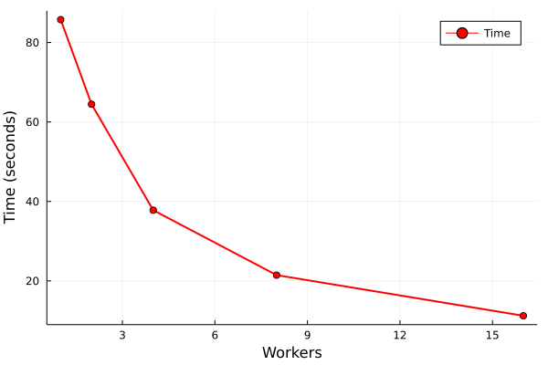

# gfp_nearneighbours_single_file

This tool generates nearest neighbours within a set of molecules
contained within a single file. There is no concept of needles or
haystack, all molecules are part of the same set.

For comparisons of one collection against another see
[gfp_lnearneighbours](gfp_lneaerneighbours.md)

For each molecules in a set, find the single nearest neighbour.
```
gfp_make.sh <fingerprints> file.smi > file.gfp
gfp_nearneighbours_single_file -n 1 file.gfp > file.nn
nplotnn file.nn > file.nn.smi
```
The resulting file will have each molecule in the file followed
by its single nearest neighbour according to the fingerprints in
the .gfp file.

## HOWTO

The following options are recognised
```
 -n <number>      specify how many neighbours to find
 -t <dis>         discard distances shorter than <dis>
 -T <dis>         discard distances longer than <dis>
 -r <number>      ensure that all molecules have at least <number> neighbours
 -z               don't write molecules with no neighbours
 -H <fname>       write histogram of closest distances to <fname>
 -b               write minimal histogram data - two columns
 -N <tag>         write number neighbours as <tag>
 -A <TAG>         write average neighbour distance to <TAG>
 -p               write all pair-wise distances in 3 column form
 -j <precision>   output precision for distances
 -y               allow arbitrary distances
 -R <number>      report progress every <number> items processed
 -S <fname>       write nnbr::NearNeighbours TFDataRecord serialized protos to <fname>
 -d               do NOT write neighbour smiles in the -S file (makes the file much smaller)
 -x               exclude smiles from the output
 -F ...           gfp options, enter '-F help' for details
 -V ...           Tversky specification, enter '-V help' for details
 -K ...           options for converting sparse fingerprints to fixed
 -X <distance>    abandon distance computation if any component > distance
 -o               cross referencing a single file. Write neighbours as index numbers
 -s <number>      specify number of fingerprints in input - not necessary
 -I <tag>         specify identifier dataitem (default 'PCN<)
 -v               verbose output
```

The most important options are the `-n` and `-T` options. These control what neighbours
are collected. If the `-n` option is used, then every molecule will have that many
neighbours accumulated, regardless of their distance.

If the `-T` option is used, then for each molecule, all neighbours within that distance
are accumulated, so it is very likely that the molecules will have differing numbers of
neighbours.

This tool can be used to compute the nearest neighbour data used by [train_test_split_optimise](train_test_split_optimise.md).

### TBB
There is a version of this tool that uses TBB (Threading Building Blocks) to subdivide
the work across threads. Many of the options are the same, but the most important is
the -h option, which controls the number of tasks applied to the nearest neighbour
determination.

This turns out to be a something complex operation involving a need to identify
chunks of the data that can be updated in parallel.

Currently the number of workers, -h option, can be one of 1,2,4,8,16. The degree
of parallelism is approximately half of the -h value. So, on an 8 core machine
-h 16 will result in almost full use of the machine, but as usual, scaling is
not linear.


Although in this case, serial execution takes 85 seconds, so an ideal 8 way
speed-up would result in -h 16 running in 10.1 seconds, but we observe 11.22
which is an unusually good speed-up for 8 cores.

A ruby script was used to write the code for 16 workers, and this could
be adapted to higher numbers of cores [script](/src/Utilities/GFP_Tools/gfp_nearneighbours_single_file_tbb.rb).
