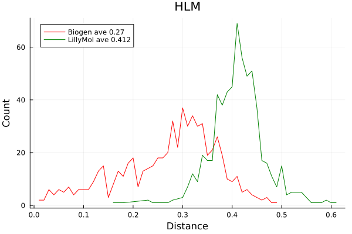
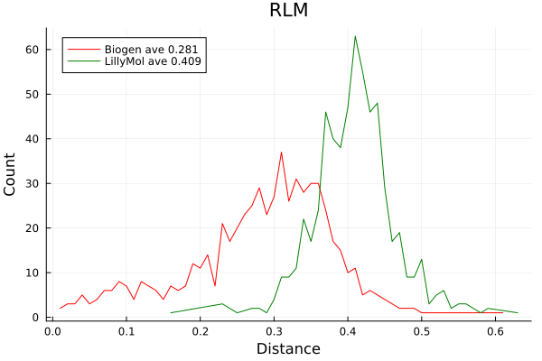
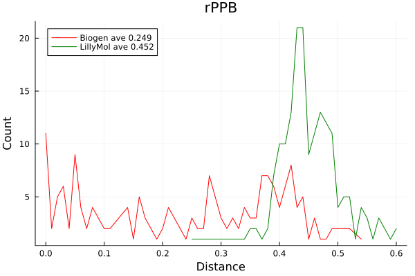

# Example of train_test_split_optimise

Based on the very nice post by Pat Walters
[Practical Cheminformatics](https://practicalcheminformatics.blogspot.com/2024/11/some-thoughts-on-splitting-chemical.html)
I decided toapply trawn_test_split_optimise to the Biogen ADME datasets
he uses.

Pat covers various splitting strategies that I will not recreate here. Instead
I will focus on the single 80/20 split of the data provided by Biogen in
their repo [BioGen](https://github.com/molecularinformatics/Computational-ADME/tree/main).

## Features

The first thing to check is the features used for model building. BioGen provides some
RDKit features, about 1340, which look like 1024 fcfp4 fingerprints (binary) and 316 'rdMD'
features - not sure what these are, but they are floating point. Pat builds models
using just RDKit EC fingerprints.

I will compare the Biogen features with a smaller set of 285 features
from LillyMol [iwdescr](/docs/Molecule_Tools/iwdescr.md) and some Abraham features.

Build XGBoost models on the Biogen training sets for both the Biogen features and
the LillyMol features. Score the Biogen training sets and measure R2, so higher numbers
are better. All models are built
in about 10 seconds. No hyperparamter tuning was attempted, use the defaults built
into LillyMol script [xgbd_make](/contrib/bin/xgbd/xgbd_make.py).

| DataSet | Biogen | LillyMol |
| ------- | ------ | -------- |
| HLM | 0.39 | 0.42 |
| hPPB | 0.53 | 0.59 |
| MDR1_ER | 0.52 | 0.50 |
| RLM | 0.42 | 0.41 |
| rPPB | 0.46 | 0.51 |
| Sol | 0.25 | 0.35 |

Generally the 285 LillyMol features perform better - although this is not universally
true, and when the Biogen features are better, the difference is small. Use the LillyMol
features going forward, especially since there are many fewer of them than what came
from Biogen. Also the LillyMol features do not have any NaN values.

Using RMS as a measure of performance shows similar results, smaller numbers are better
| DataSet | Biogen | LillyMol |
| ------- | ------ | -------- |
| HLM | 0.494 | 0.481 |
| hPPB | 0.510 | 0.477 |
| MDR1_ER | 0.493 | 0.505 |
| RLM | 0.584 | 0.594 |
| rPPB | 0.548 | 0.526 |
| Sol | 0.656 | 0.604 |

All performance measures were calculated with iwstats which provides a variety of
other measures of model performance. The trend of preference for the LillyMol features
holds across other measures.

## Split the datasets.
Use train_test_split_optimise to split each dataset. First combine both train and test
to get a combined dataset and generate fingerprints.

```
cat train.smi test.smi > combined.smi
gfp_make.sh combined.smi > combined.gfp
descriptor_file_cat train.activity test.activity > combined.activity
```
Or if individual .gfp files for train and test are available just cat those.

Generate nearneighbours with a fairly long distance cutoff - these datasets are small
so there is no need to skimp on memory or CPU
```
gfp_nearneighbours_single_file_tbb -T 0.45 -S combined.nn.dat combined.gfp
```
Takes under 2 seconds to process all six datasets. If you had larger datasets
using more threads with gfp_nearneighbours_single_file_tbb would be
advantageous.

Once the combined nearneighbour file is available, use it to generate
the optimised train/test splits.
```
train_test_split_optimise -f 0.8 -n 1 -S SPLIT -o 1000000 -r 50000 -v combined.nn.dat
```
which takes 23 seconds to process all datasets. None of them were still doing
successful optimisations at 1M attempts, most had ceased to progress before
600k attempts, some before 400k.

The optimisation has created the files 'SPLITR0.smi' and 'SPLITE0.smi'.
Generate fingerprints for each of those so we can do distance comparisons.
```
gfp_make.sh SPLITR0.smi > SPLITR0.gfp
gfp_make.sh SPLITE0.smi > SPLITE0.gfp
```

Or if there were larger datasets where regeneration of fingerprints was
burdensome, use fetch_tdt_quick and the individual SPLIT*.smi files to extract them
from combined.gfp.

## Separation
For each of the splits provided by Biogen, we can get the distributon of nearest
neighbour distances between train and test. I will show full histograms rather than
the plots Pat showed. These plots superimpose the train/test split distances in
the original Biogen splits with what has been done above.

To compute the nearest neighbour histogram for both splits
```
gfp_lnearneighbours -p test.gfp -n 1 train.gfp > test.nn
nplotnn -H H.txt test.nn

gfp_lnearneighbours -p SPLITE0.gfp -n 1 SPLITR0.gfp > test.opt.nn
nplotnn -H H.opt.txt test.opt.nn
```
Import the resulting 'H*txt' files into your favourite plotting package
and display the results. X axis is distance (think 1 - similarity) so
for a well separated split, we want very few short distances and many
more test set molecules a long way from the training set.







Indeed this is what we see. Several of the splits have hardly any train/test
set molecules separated by small distances. The optimisation appears to have
worked.

## Models
The work of Sheridan and others supports the idea that test set molecules
well separated from the training set will be harder to predict. We can now
further examine that hypothesis in the limit of strongly separated train and
test sets - note there is no claim of this being an optimal set, an 
optimal split is likely to be very hard to compute.

Using the LillyMol features, compare the RMS results for the new models with
what was observed above. Column 1 is the default split from Biogen and
column 2 is from the optimised split. Using 285 LillyMol features. Lower numbers better.

| DataSet | Default | Optimised |
| ------- | ------ | -------- |
| HLM | 0.481 | 0.581 |
| hPPB | 0.477 | 0.598 |
| MDR1_ER | 0.505 | 0.531 |
| RLM | 0.594 | 0.671 |
| rPPB | 0.526 | 0.635 |
| Sol | 0.604 | 0.632 |

If we look at R2, higher numbers better, the corresponding results are

| DataSet | Default | Optimised |
| ------- | ------ | -------- |
| HLM | 0.418 | 0.241 |
| hPPB | 0.595 | 0.465 |
| MDR1_ER | 0.500 | 0.316 |
| RLM | 0.411 | 0.392 |
| rPPB | 0.510 | 0.371 |
| Sol | 0.352 | 0.205 |

Regardless of how performance is measured, the performance of the
model built using the optimised split is significantly worse than
the model built using the default split.

Note that these are still valid models, if we randomise the response
we can see what a random model would do. We find an R2 of zero and,
for hPPB, an RMS of 0.976 (compare 0.598 above). So there is still
enough information in the training set to be informative of the test
set, but the effectivness of the model is significantly reduced.

This finding further supports the findings of Sheridan that distance from
the training set is an important indicator of model performance.
This is of course in accord with reasonable medchem intuition.

## Details
All work for this study was done with dopattern. For example, descriptor
computation for the optimised split was done via
```
dopattern.sh -do HLM,hPPB,MDR1_ER,RLM,rPPB,Sol
        'cd % && make_descriptors.sh -w -abr -j 2 SPLITR0.smi > SPLITR0.lly
dopattern.sh -do HLM,hPPB,MDR1_ER,RLM,rPPB,Sol
        'cd % && make_descriptors.sh -w -abr -j 2 SPLITE0.smi > SPLITE0.lly
```
which could theoretically have been combined into a nested dopattern invocation.

Building the models was done via
```
dopattern.sh -do HLM,hPPB,MDR1_ER,RLM,rPPB,Sol 
        'cd % && xgbd_make.sh --mdir SPLIT --activity combined.activity SPLITR0.lly'
```
where dopattern cycles over subdirectories, each one containing one of the
datasets. Evaluation was done via iwstats
```
dopattern.sh -do HLM,hPPB,MDR1_ER,RLM,rPPB,Sol 
        'cd % && iwstats -E combined.activity -p 2 -w -Y allequals test.split.pred' | grep R2
```
dopattern can provide key productivity leverage when performing an identical set 
of operations across a range of datasets. And while it was not done here, dopattern
enables parallel and distributed computation of the individual tasks, enabling
further efficiencies.
